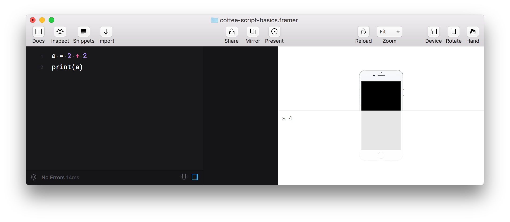
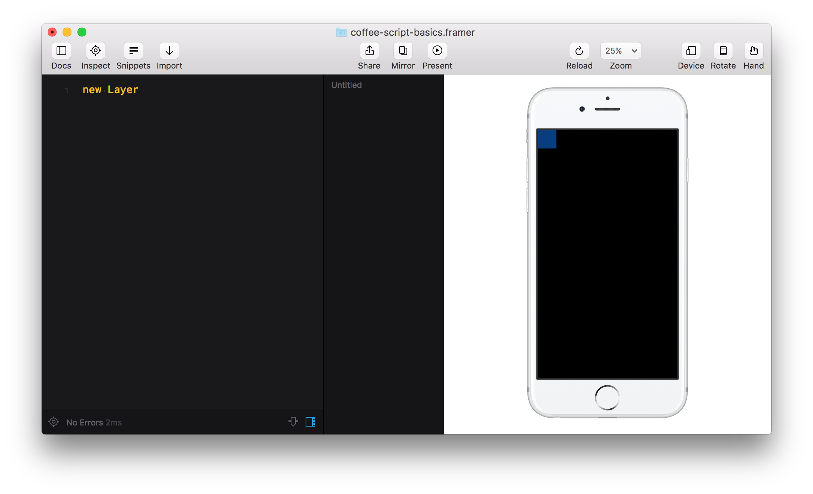
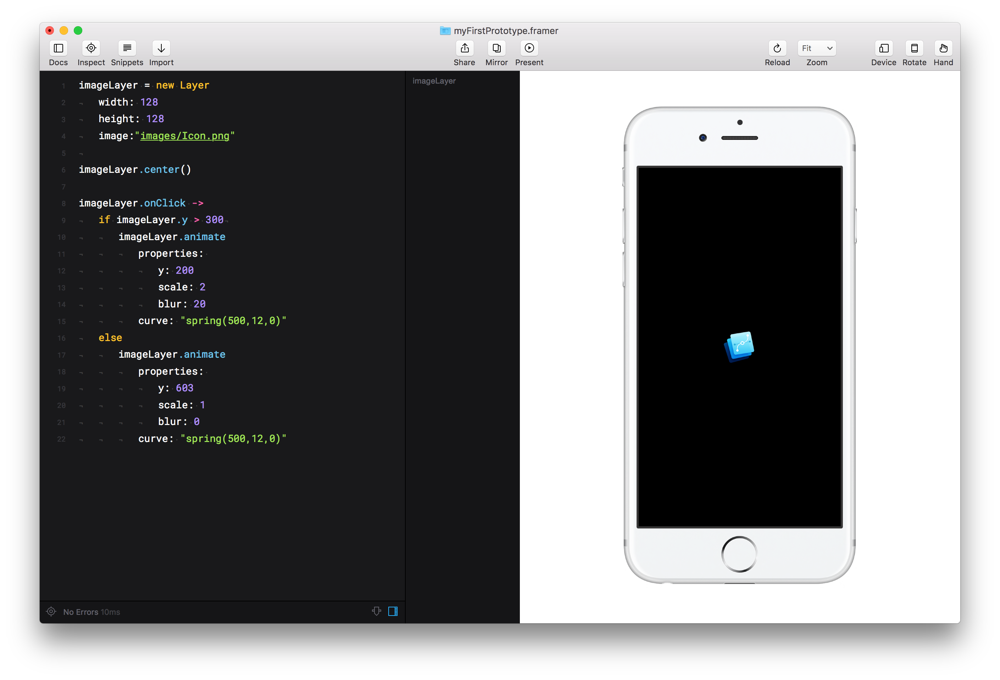

Без основ программирования овладеть Фреймером сложно: непонятно, как работают функции и модули, которые ты используешь; сложно исправлять возникающие ошибки и использовать преимущества кода на полную. Основы не так сложны, как может показаться.

---

---

Простейшая программа выглядит так:

``` CoffeeScript
2 + 2
```

Результат вычислений сохраняют в *переменную*, чтобы использовать позже:


``` CoffeeScript
a = 2 + 2
```

Чтобы просматривать содержимое переменной, есть команда `print`:

``` CoffeeScript
a = 2 + 2
print(a)
# » 4
```


<small>Содержимое `print` выводится справа снизу — во всплывающем белом окне.</small>

Чтобы вывести результат вычислений, не обязательно сохранять его в переменную. Можно сразу написать внутри команды `print`:

``` CoffeeScript
print(5 * 10 + 2)
# » 52
```

---

Если мы работаем не с числами, а с текстом, то его нужно брать в кавычки (чтобы компьютер мог отличать имена переменных от значений):

``` CoffeeScript
hello = 'bye'

b =  hello
c = 'hello'

print(b) # » "bye"
print(c) # » "hello"
```

Еще есть зарезервированные слова `true` и `false`, чтобы хранить результаты сравнений. Например, «1 > 3» — это ложь, а «10 > 3» — правда:

``` CoffeeScript
print(1 > 3)
# » false

print(10 > 3)
# » true
```

Если мы пишем их сами, то кавычки не нужны — `true` и `false` не являются текстом. Их тип данных — логика.

``` CoffeeScript
a = true
b = false
```

---

## Условия

Код может выполняться не только по порядку строка за строкой. Используя сравнения, мы можем попросить программу выбрать один из двух (или более) возможных вариантов:

``` CoffeeScript
b = 3

if b < 2 
	print 'Меньше двух'
else 
	print 'Больше двух либо равно'

# » "Больше двух либо равно"
```

##### Неправильные отступы в  CoffeeScript считаются ошибкой. С их помощью мы показываем вложенность блоков. В других языках эту функцию выполняют скобки (а отступы расставляют только для читаемости кода).

Так, например, выглядят условия на JavaScript:

``` JavaScript
// JavaScript
if (b < 2) {
	print('Меньше двух');
} else {
	print('Больше двух либо равно');	
}
```

---

## Циклы

Еще один способ выполнять код не по порядку — зациклить какую-то его часть на некоторое время. Представьте, что нам нужно вывести все четные числа от 2 до 20:

``` CoffeeScript
print(2)
print(4)
print(6)
print(8)
print(10)
print(12)
print(14)
print(16)
print(18)
print(20)
```

С помощью циклов это выполняется гораздо проще:

``` CoffeeScript
number = 0
for [0...10]
	number = number + 2
	print(number)
```

Такой код позволит быстро вывести даже четные числа от 2 до 2000. 

К тому же с циклами вносить изменения: например, заменив одну только двойку на единицу, мы выведем все четные числа. А а предыдущем примере пришлось бы править каждую строку.

---

## Функции

Внутри программы можно создать подпрограмму — *функцию*; дать ей любое имя и вызывать в разных частях прототипа:

``` CoffeeScript
summa = (x, y) ->
	result = x + y
	print(result)
```

|         |                           |
| --------|---------------------------|
| `summa` | имя функции               |
| `x, y`  | параметры                 |
| `–>`    | заменяет слово `function` |

Код внутри `->` не выполняется, пока мы его не вызовем с какими-то параметрами. Параметры можно вводить каждый раз разные: 

``` CoffeeScript
# Объявление функции
summa = (x, y) ->
	result = x + y
	print(result)

# Вызов функции
summa(2, 2)      # » 4
summa(5 + 5, 20) # » 30
summa(a, b)      # » 7
```


Кстати, `print` — это тоже функция:

``` CoffeeScript
print(a)
```

Функция может быть без параметров. Тогда при ее вызове мы пишем пустые скобки (опять же, чтобы показать, что это запуск функции, а не переменная):

``` CoffeeScript
proizv = ->
	result = 2 * 2 
	print(result)

proizv()
```

##### CoffeeScript позволяет не ставить скобки при вызове функций, если это не вызывает разночтений. 

Но если у функции нет ни одного параметра, то скобки убирать нельзя:

``` CoffeeScript
summa 2, 2
summa a, b
proizv() # ← Пустые скобки обязательны

print "Hello world"
print a
```

Также функции бывают *анонимными*:

``` CoffeeScript
->
	result = a / 10
	print result
```

Их используют, чтобы передавать в качестве параметров в другие функции либо в объекты.

---

## Объекты

Грубо говоря, объект — это набор переменных, объединенных одним именем. Создание объекта выглядит так:

``` CoffeeScript
designer = 
	name:  'Anton'
	city:  'Moscow'
	age:    29
```

Переменные внутри объекта называются *свойствами*. 

|                       |                  |
|-----------------------|------------------|
| `designer`            | объект           |
| `name`, `age`, `city` | свойства объекта |


##### Чтобы при создании нового объекта присвоить значения его свойствам, используют двоеточие, а не знак равенства.

Теперь мы можем обращаться к свойствам объекта так:

``` CoffeeScript
print(designer.name)
b = designer.age - 18
designer.city = 'St. Petersburg'
```

Помимо свойств у объектов могут быть свои функции. Их называют *методами*. Чтобы создать метод, присвойте одному из свойств анонимную функцию:

``` CoffeeScript
designer
	name: 'Anton'
	age: 29
	sayhello: ->
		print 'Hello!'

designer.sayhello()
```

В работе над прототипами мы чаще будем работать с методами, чем с простыми функциями:

``` CoffeeScript
layerA.center()
layerA.placeBehind(layerB)
layerA.animate(properties: {x: 20})
layerA.onClick(-> layerA.opacity = 0.4)
```

Параметры методов тоже можно не брать в скобки, если это не вызывает разночтений. Если параметры отсутствуют, то скобки обязательны:

``` CoffeeScript
layerA.center()
layerA.placeBehind layerB
layerA.animate properties: {x: 20}
layerA.onClick -> layerA.opacity = 0.4
```

Методы `animate` и `onClick` еще разберем ниже.

--- 

## Конструкторы и компоненты

Конструкторы довольно сложная тема, а в прототипировании их используют нечасто. Поэтому просто познакомися с ними, чтобы понять, как работают слои во Фреймере.

Чтобы не пересобирать каждый раз однотипные объекты с одгними и теми же свойствами, в JavaScript существуют *конструкторы* — шаблоны заранее настроенных объектов. Конструктор выглядит как обычная  функция:

``` CoffeeScript
Car = ->
	this.name  = 'BMW'
	this.color = 'black'
	this.speed =  220
```

Теперь достаточно написать одну фразу `new Car`:

``` CoffeeScript
myCar = new Car
```

…и у нас появится новый объект с уже заполненными свойствами:

``` CoffeeScript
print myCar.name
print myCar.color
print myCar.speed
# » "BMW"
# » "black"
# » 220
```

Конструкторы нужны, чтобы писать свои собственные компоненты и модули. В них можно предусмотреть количество и тип параметров, дать каждому свойству имя, настроить значения по умолчанию. 

``` CoffeeScript
Student = (name: a, age: b, career: c) -> 
	this.name    = a ? 'Ivan'
	this.age     = b ?  17
	this.city    = c ? 'Moscow'
```

Этот код достаточно сложный для новичков, но тут можно увидеть следующее: конструктор проверяет наличие введеных параметров (`a ?`, `b ?`, `c ?`) и если они отсутствуют, то сам заполняет их значениями по умолчанию (`'Ivan'`, `0`, `'child'`).

Теперь мы можем создавать объект с большей гибкостью. Например, задать самостоятельно два свойства, а остальные оставить на совести конструктора:

``` CoffeeScript
engineer = new Student
	name: 'Egor'
	age:   19

print developer.name
print developer.age
print developer.city
# » "Egor"
# » 19
# » "Moscow"
```

Во Framer.js есть 6 типов компонентов, на основе которых создаются все прототипы:

| | | |
|-|-|-|
|1. Слои|Layer|
|2. Фоны|BackgroundLayer|
|3. Скрол|ScrollComponent|
|4. Пэйджинг|PageComponent|
|5. Слайдеры|SliderComponent|
|6. Видео|VideoLayer|

Например, для объекта Layer создатели Framer.js настроли более 100 свойств и методов, позволяющих вставлять изобржения, обрабатывать <nobr>драг-н-дроп,</nobr> вращать слои в 3D и т.д. Использование компонентов ускоряет работу, но без потери гибкости: мы можем менять любые свойства или добавлять свои.

Для создания слоя используют оператор `new`:

``` CoffeeScript
layerA = new Layer 
```

По умолчанию Layer создает полупрозрачный синий квадрат размером 100×100 пикселей и размещает его по координате (0, 0) — в левом верхнем углу телефона.



Попробуем вывести значения свойств, которые мы не задавали:


``` CoffeeScript
layerA = new Layer 

print layerA.opacity
print layerA.width
# » 1
# » 100
```

---

## Анимация — это функция

Мы уже разобрали функции и методы. Одни из самых используемых методов объекта Layer — это анимации. `animate` — сложная функция. 

``` CoffeeScript
layerA.animate(properties: {x: 200, y: 400}, time: 0.5, curve: "ease-in")
```

- У нее 5 параметров: `properties`, `curve`, `time`, `repeat`, `delay`.
- Обязательно указывать только `properties`, остальные параметры по желанию.
- Внутри `properties` можно написать сколько угодно свойств слоя, но в формате объекта (поэтому и появились скобки `{}`).

Еще CoffeeScript позволяет записать эту функцию так:

``` CoffeeScript
layerA.animate
	properties:
		x: 200
		y: 400
	time: 0.5
	curve: "ease-in"
```

---

## События

Чтобы сделать прототип интерактивным, под каждое действие пользователя (клик, скрол, долгое нажатие) пишут свою функцию. Прототип начнет ежесекундно проверять, совершил ли пользователь действие и запускать в ответ на него подпрограмму. 

Действия пользователя называют *событиями*, а функцию, срабатывающую в ответ — *колбэком* или *обработчиком события*. Событие работает как обычный метод:

``` CoffeeScript
layerA.onClick(functionA)
```

Например, сделаем по клику слой красным:

``` CoffeeScript
# Колбэк
makeRed = ->
	layerA.backgroundColor = "red"

# Событие
layerA.onClick(makeRed)
```

Колбэк можно не брать в скобки:

``` CoffeeScript
layerA.onClick makeRed
```

Зачастую колбэкам не нужно никакого имени, ведь в коде мы используем его только один раз — чтобы передать внутрь события. Код можно сократить, если использовать в качестве колбэка анонимную функцию:

``` CoffeeScript
layerA.onClick(-> layerA.backgroundColor = "red")
```

Либо без скобок:

``` CoffeeScript
layerA.onClick -> layerA.backgroundColor = "red"

layerA.onClick -> 
	layerA.backgroundColor = "red"
```


<small>myFirstPrototype.framer</small>
