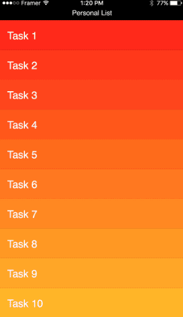

Перевод статьи с Медиума


---

Я сделал множество прототипов во Фреймере. В одних показывал микро-взаимодействия, в других описывал ключевые сценарии для заказчиков, чтобы синхронизировать наши видения. Часть из них предназначалась разработчикам, чтобы заручиться их поддержкой либо подбить на доделки, которые могли повысить качество исполнения. Благодаря нескольким прототипам я собрал фидбек и инсайты пользователей в партизанских тестированиях.

Прототипы меняются из версии в версию, но смысл в них есть, только когда они делаются быстро (или в разумные сроки), потому что в конце концов это&nbsp;— прототипы, а не продукты. Поэтому критически важно научиться писать код, который будет компактным и удобным для регулярных доработок. 

Без знания массивов Фреймер не так полезен. Массивы — мощное средство, чтобы писать более эффективный, чистый, читаемый и легко редактируемый код. И главный бонус, конечно же, — экономия времени.


## Зачем нужны массивы
В примере ниже каждое из событий работает идентично. Вы кликаете на картинку — выезжает подстраница, одновременно с этим слегка сдвигается фон. Когда вы кликаете на стрелку «Назад», все возвращается обратно. Идентично абсолютно каждое событие.

<center></center>

Тоже самое здесь. Каждая функция работает идентично. Если вы свайпаете вправо, то бэкграунд становится зеленым, а нижние пункты поднимаются вверх. Также идентичны все анимации.

<center></center>

#### Компактность

В первой своей статье я показывал прототип Инбокса (Inbox 1–2), в котором подобные вещи были сделаны не совсем рационально (хотя прототип от этого работал ничуть не хуже). Мы прописывали состояния и события индивидуально для каждого из 15 слоев. Представьте, если бы их было 100.

Вот именно. Поэтому ниже я выложил другой прототип — Inbox 1–3. Там я показал, как упростить код с помощью массивов. Общее количество строк уменьшилось со 119 до 73. С массивами код становится более сжатым.

#### Организованность
Подождите… 73 строки вместо 119? Ведь это не просто меньше кода. Нередко за компактным кодом скрывается лучшая организация. Вспомните появление нового поста в ленте Фейсбука: все текущие посты должны сдвинуться вниз, чтобы освободить место сверху. В этом случае вы можете поменять координату у каждого нижнего поста. Но если посты были организованы в массив, то достаточно поменять значения в 2-3 строках кода для всех сразу. Тогда вам не придется при каждом изменении следить за значениями всех постов отдельно. Это было бы кошмарно.


## Как работают массивы
В этом руководстве мы попрактикуемся на прототипах приложений Inbox и Instagram. Но прежде сделаем простой массив.

#### Создание
Массив задается с помощью квадратных скобок «[ ]»:

``` CoffeeScript
arr = [ ]
```

Он может содержать любой объект: число, текстовую строку или другой массив. Элементы внутри массива разделяются запятой «,»:


``` CoffeeScript
arr1 = [100, 200, 300]
arr2 = ["hello", "framer"]
arr3 = [arr1, arr2]
```

#### Редактирование
Массив — упорядоченный список объектов. Каждый объект автоматически получает номер порядковый номер, начиная с нуля. Мы можете получить доступ к объекту внутри массива, указав его номер в квадратных скобках (например, arr1[0]):

``` CoffeeScript
print arr1[0] # » 100
print arr1[1] # » 200
print arr1[2] # » 300
print arr1    # » [100, 200, 300]
```

Вы можете просто присвоить элементу новое значение. Посмотрите, как заменить первый объект в массиве arr1:

``` CoffeeScript
arr1[0] = 150
print arr1
# » [150, 200, 300]
```

#### Добавление
Если вы хотите добавть больше объектов уже после создания массива, используйте метод .push. Он добавляет элементы в самый конец массива и общее число элементов (которое можно узнать через метод .length) увеличивается:

``` CoffeeScript
arr1.push(400)
arr1[3] = 400 # перезаписать элемент в этой ячейке
print arr1.length # » 4
```

Разобравшись с массивами, вы постоянно будете хранить в них слои. Добавить слой в массив легко:

``` CoffeeScript
layer = new Layer
arr.push(layer)
```

#### Вынести (или удалить) элемент
Чтобы удалить последний элемент массива, используйте метод .pop(). Если вы не хотите потерять элемент после удаления, что можете сохранить его в другую переменную:

``` CoffeeScript
val = arr1.pop()
print val         # » 400
print arr1        # » 150, 200, 300
print arr1.length # » 3
```

#### Копирование
Другая интересная вещь, с которой нужно быть осторожными (и которая отличает массивы от простых чисел, булевых переменных true/false и строк текста) заключается в следующем: если вы присвоили значение массива какой-то другой переменной и поменяли его там, то все изменения отразятся и на исходном массиве тоже. Например:

``` CoffeeScript
newArr = arr2
print newArr      # » ["hello", “framer"]
newArr[0] = "bye"
print newArr      # » ["bye", “framer"]
print arr2        # » ["bye", “framer"]
```

Поэтому если вы хотите получить не связанный с исходным массив, напишите как ниже. Теперь любые изменения в newArr никак не отразятся на arr2:

``` CoffeeScript
newArr = arr2[..]
```

One note here is that you should think of object and visual object(layer) as two separate things. Although you remove(.pop() or whatever means) an object in an array which you think it’s a layer, the layer will still be visible. You need to .destroy() the layer as well.


## Лучшие друзья массивов — это циклы
Польза массивов раскрывается в использовании их с циклом for. Потому что циклы тоже ограждают нас от рутинной повторяющейся работы:

#### Основы цикла for
Здесь я создаю несколько слоев за раз и складываю из в массив:

``` CoffeeScript
layers = []
for i in [0..9]
   layer = new Layer
   layers.push(layer)
# Последние две строки можно уместить в одной:
# layers[i] = new Layer
```

Если перевести код выше на человеческий язык, получится примерно следующее:

```
создать пустой массив с именем layers.
повторить, увеличивая индекс(i) от 0 до 9:
   создать новый слой с именем layer;
   добавить layer в конец массива layers.
```

#### Диапазоны
Мы написали внутри цикла диапазон [0..9], чтобы он прошел 10 итераций. То же самое можно было бы записать с тремя точками как [0…10], где 10 было бы последним номером. Также, необязательно всегда начинать с нуля (хотя чаще всего это работает исправно). Вы можете поставить в начало и конец диапазона любые числа. See the example below. What do you think the result will be? Well, I’ll not steal your juicy part.

``` CoffeeScript
for i in [9..0]
   print i
```

Как мы говорили выше, число объектов в массиве может меняться. Вы можете добавлять и удалять элементы из массива. Соответственно вам нужно менять и конечное число в диапазоне цикла for. Но если вы используете метод .length, можете не беспокоиться о диапазонах:

``` CoffeeScript
for i in [0...layers.length]
   layers[i].opacity = 0.5
```

Есть еще более простой способ. This enhanced for loop below loops through all layers. Обратите внимание, что вы можете писать любое имя вместо layer. К примеру, х. Переменная х будет жить только пока выполняется цикл:

``` CoffeeScript
  for layer in layers
      layer.opacity = 0.5
# for x in layers
#     x.opacity = 0.5
```

Иногда вам все-таки нужен индекс (i). Последний вид цикла for можно легко использовать вместе с индексом, что я ниже покажу на прототипе Inbox.

``` CoffeeScript
for layer, i in layers
   layer.opacity = i / layers.length

# » 0.0
# » 0.1
# » 0.2
# » 0.3
# » 0.4
# » 0.5
# » 0.6
# » 0.7
# » 0.8
# » 0.9
```

#### Массив слоев, импортированных из Sketch
The even more simple way is here. You can make an array with Sketch objects(folders) in only one line like below. It pulls all the children objects inside the Sketch folder called someLayer and put them into childrenLayers in order. I’ll show you the actual application with the Inbox example.

``` CoffeeScript
childrenLayers = sketch.someLayer.children
```

Что если нам нужен только первый слой из десяти? Что если нам нужны только первые пять, а остальные нет? Используйте диапазоны:

``` CoffeeScript
childrenLayers2 = sketch.someLayer.children[0]
childrenLayers3 = sketch.someLayer.children[0...5]
```

Вот и все! Вы выучили основы массивов. Теперь let’s roll our sleeves and get into the actual prototypes!

<center></center>
<center><small>© Kakao corp.</small></center>


## Инбокс
Вы можете сказать заготовку прототипы. Я закодил базовую структуру, чтобы быстрее перейти into the juicy part. Также можете изучить .sketch-файл, там я организовал слои специально под работу с массивами.

<center></center>
<center><small><a href="http://share.framerjs.com/lld77t4iq92d/">http://share.framerjs.com/lld77t4iq92d/</a></small></center>

Обратите внимание, каждая круглая кнопка анимирована с легким отставанием, при нажатии на FAB (Floating Action Button). Сейчас вы вместе сделаем это. Я буду описывать все в терминах слоев, состояний и событий.

#### Слои-массивы
Прежде всего создаем массивы. inbox.options.children вызывает из .sketch-файла все вложенные в options группы: option1, <nobr>option2, … — </nobr>и складывает массивом в переменную options (см. изображение ниже)

``` CoffeeScript
options = inbox.options.children
faces = []
originalYs = []
```

Теперь заполним пустые массивы, которые мы создали. Under each option object, there are name and face. The children layers can be called using .children. Since face is the second object from the bottom inside option (refer to the image below), we can say option.children[1]. If we have to call name, we can say option.children[0].

The originalYs array stores each option’s original y position. We need this array when we restore the original positions of options. We set each option’s opacity to zero because it shouldn’t be visible until the FAB is clicked.

``` CoffeeScript
for option in options
   faces.push(option.children[1])
   originalYs.push(option.y += optionOffsetY)
   option.opacity = 0
```

There are a number of other ways to make the faces array. If we didn’t use the for loop, we should have done some brainless typings. I don’t recommend this way unless it’s inevitable.

``` CoffeeScript
faces = [inbox.face1, inbox.face2, inbox.face3, inbox.face4, inbox.face5]
```

There’s another way like below. This might be a good alternative, but less manageable. If you change a folder name in Sketch, it will break.

``` CoffeeScript
faces = []
for i in [1..5]
   face = inbox["face#{i}"]
   faces.push(face)
```

This might be hard to understand but the one line code below works the same.

``` CoffeeScript
faces = (option.children[1] for option in options)
```

#### Состояния
С массивами и циклом for мы можем назначить состояния всем слоям за раз. Например, для изменения масштаба от 0 к 1 нужно записать:

``` CoffeeScript
for face in faces
   face.scale = 0
   face.states.add
      on: {scale: 1}
```

You can apply states to overlay, labelCompose, iconPlus and iconWrite respectively with desired properties.

``` CoffeeScript
inbox.overlay.states.add
   on: {opacity: 1}
```

#### События
We are going to make two events for FAB and overlay objects. The FAB event is for animating faces and labels to appear and the overlay event is to reverse. Let’s make the FAB event first.

``` CoffeeScript
inbox.fab.onClick ->
   for option, i in options
      option.animate
         properties:
            y: option.y - optionOffsetY
            opacity: 1
         delay: 0.04 * i
```

Each option containing face and name moves up as much as optionOffsetY and fades in. Each animation is fired with a slight delay. The i value is increased in each loop which causes to extend the total delay time. You can see the time changes by printing “delay: ” + 0.04 * i.

You can do the same for faces.

``` CoffeeScript
for face, i in faces
   face.animate
      properties:
         scale: 1
      delay: 0.04 * i
```

For the rest objects, you can change their states to on.
inbox.overlay.states.switch("on")   # do the same with labelCompose, iconPlus and iconWrite

The FAB event is now done! You can do the same for the overlay event. When the grey overlay is clicked, everything goes to the original state. So you restore all changed states to default.

``` CoffeeScript
inbox.overlay.onClick ->
   for option in options
      option.y = originalYs[i]
      option.opacity = 0
```

One thing you need to pay attention to is that you can’t just say ‘option.y -= optionOffsetY’ instead of ‘option.y = originalYs[i]’. Because when you tap the button fast more than twice, it will be misaligned. That’s why we use the array to store the original y values.

That’s it! Compare yours with this Completed Prototype (Inbox 2–1). I also simplified it further by using functions. (Inbox2–2)

## Инстаграм
Комбинация массивов и цикла for полезна для создания двумерной сетки. В прототипы Инстаграмам сетка картинок 3х3. Как это делается…

Чтобы сделать 2-мерную сетку, мы можем задействовать цикл for дважды. В первый раз это может показаться сложным для понимания, но вы поймете лучше, когда выведите через print значения для столбцов и строчек. В итоге оба цикла проходят 9 (3×3) итераций:

``` CoffeeScript
for column in [0...3]
   for row in [0...3]
      print "column: " + column+ ", row: " + row
      # create a layer
      # add to an array
```

The statements inside the row for loop are executed 3 times when column is 0. It goes for the same as column is increased by 1. We can make a grid by multiplying row to x value and column to y value of the newly made layer.

I guess you can understand the other parts. If you want to see an even more concise code, please refer to this prototype(Instagram 1–2). I removed unnecessary repetitions and simplified by using functions (which I’ll cover for the next article). I also added swipe gestures.

## Good Examples to Try Out
Для дальнейшего изучения массивов, разберите следующие замечательные примеры:

- Photo Feed, Jay Stakelon (также горячо рекомендую видео-туториал)
- Arrays & For Loops Basics, Marc Krenn (heavily annotated for beginners)
- Scroll and Click, Benjamin den Boer (Framer Team)
- Mobile Navigation, Giel
- Load and Display, Benjamin den Boer
- Clear App, мой прототип и расширенная версия от Jiwoong Lee

Still thirsty? Join in the super active Framer FB group, post your work and ask questions!

## Спасибо
Эта статья — продолжение поста «New to Framer? Just 3 Things to Get You Started», руководство по CoffeeScript и Фреймеру для новичков. Более 500 человек залайкало первую статью на Медиуме, чтобы побудило меня написать вторую. Если она оказалась полезна для вас, пожалуйста, нажмите лайк ♥ на Медиуме. Я буду вам признателен.

Выражаю благодарность Марку Кренну и Куну Бок за фидбек по первым версиям статьи.
