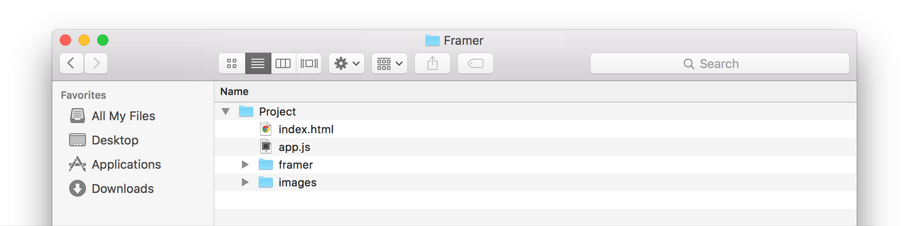
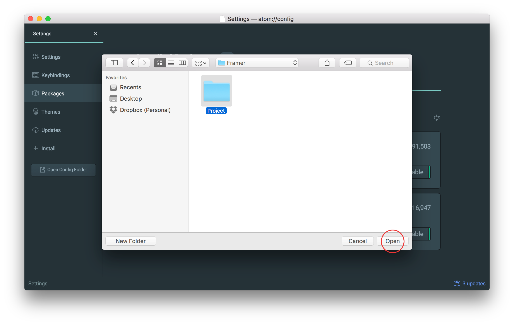
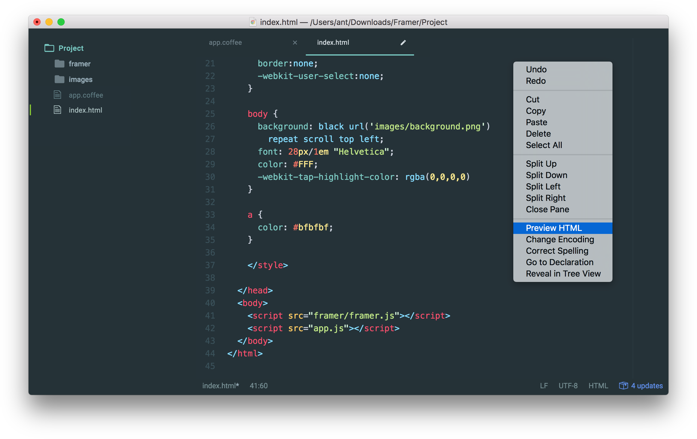

Framer.js и Framer Studio — разные вещи. Framer.js — это бесплатная JavaScript-библиотека, которой можно пользоваться в любом редакторе кода; Framer Studio — платное приложение. Я расскажу, как с помощью редактора Atom пользоваться Фреймером бесплатно на Windows и OS X.


---

>Эта статья — дополненный перевод статьи Кенни Чена [Using Framer on Windows with Atom](http://www.prototypingwithframer.com/framer-on-windows-with-atom/) из его блога Prototyping with Framer

Прототип во Фреймере — это обычный сайт, который выглядит как папка с файлами (шаблон проекта можно скачать [в репозитории Фреймера](https://github.com/koenbok/Framer#get-started) на Гитхабе:

- **index.html** запускается для просмотра прототипа. Он уже правильно настроен для любого проекта. Его придется менять, если вы хотите обновить ссылку на новую версию библиотеки Framer.js, либо добавляете в проект другие JavaScript-библиотеки ([D3.js](http://d3js.org), [Hammer.js](http://hammerjs.github.io)).
- **app.coffee** — главный файл проекта. Здесь мы пишем весь код на языке CoffeeScript. 
- **app.js** — скомпилированный код прототипа, который будет работать в браузере. Он получается автоматически из файла app.coffee.
- **/framer** — папка с самой библиотекой (ее можно удалить, т. к. в репозитории хранится очень старый шаблон).
- **/images** — папка с нарезкой нашего макета, шрифтами и прочими файлами. 


<small>Типичный проект во Фреймере</small>

Все эти операции: создание нового проекта, конвертация CoffeeScript, моментальный предпросмотр прототипа — делает Framer Studio. Нам же придется организовать их самостоятельно. 


## 1. Установка Атома
Атом — редактор кода от разработчиков Гитхаба. Его стоит выбрать за удобный интерфейс установки плагинов, в котором ненужно лезть в командную строку и учить команды наизусть. Скачать здесь:

<center><h3>[atom.io](https://atom.io)</h2></center><br>

После установки мы видим экран приветствия:


Нужно выбрать Install a Package › Open Installer и попадаем сюда:


## 2. Установка Coffee-Compile и HTML-Preview
Вбиваем в поиске coffee compile и html preview. Устанавливаем их:


Теперь нужно правильно настроить плагины:
- в настройках Coffee-Compile включить **Compile on save without preview**. Наш код будет конвертироваться в JavaScript по каждому нажатию <kbd>Ctrl</kbd><kbd>S</kbd> на Винде (и <kbd>Cmd</kbd><kbd>S</kbd> на Маке). 
- в настройках HTML-Preview включить **Trigger On Save**. Как только изменится файл с JavaScript, превью моментально отобразит все изменения.


## 3. Обвновление шаблона проекта

Каждый новый проект создается на основе шаблона. Его нужно скачать [из репозитория Фреймера](https://github.com/koenbok/Framer#get-started) на Гитхабе:


Теперь откроем папку в Атоме. Чтобы открылся весь проект, а не один его файл, не кликайте по папке два раза — просто выделите ее и нажмите кнопку Open (либо <kbd>Enter</kbd>).



Если все сделано правильно, то слева в редакторе мы увидим список файлов нашего проекта. Первым делом нужно переименовать файл app.js в app.coffee:


Теперь заходим в index.html и в самом низу ищем строчку, где подключается библиотека: `<script src="framer/framer.js"></script>`.


>**Важно!** Обновите ссылку на библиотеку.

>Шаблон в репозитории не менялся больше года, поэтому по адресу "framer/framer.js" лежит старая библиотека без последних обновлений. Актуальная версия находятся на сайте [builds.framerjs.com](http://builds.framerjs.com). 


<small>[builds.framerjs.com](http://builds.framerjs.com)</small>

Вы можете скачать файлик framer.js и положить его в папку проекта, либо просто скопировать ссылку. (Во втором случае для работы прототипа потребуется доступ в интернет.)


## 4. Превью прототипа

Чтобы включить превью, нажимаем правой кнопкой внутри index.html и выбираем **Preview HTML**.



Теперь можно закрыть вкладку index.html (но не **index.html Preview**). Попробуем написать пробный код, чтобы проверить работу окружения:

- я сохранил в папку images изображение с домашним экраном Айфона.
- вписал код и нажал «Сохранить».
- автоматически создался файл app.js (сработал Coffee-Compile) и изображение появилось на превью (сработал HTML-Preview).


На картинке видно, что превью отображается экран в размере 100%. Это неудобно, т. к. высота экрана Айфона в пикселях (1440px) больше, чем высота Макбука (900px). Плюс ко всему превью растягивает прототип в пропорциях окна. 

Чтобы это починить, можно вписать следующий код, который необходимо удалять перед публикацией прототипа в интернет:

```CoffeeScript
# Осторожно! Не копируйте этот код, а напишите сами —
# при копировании сбиваются отступы и пробелы.

screen = new Layer
  width: 750
  height: 1334
  clip: true
  backgroundColor: "black"

screen.scale = Screen.height / screen.height
screen.center()
Framer.Defaults.Layer.parent = screen

```


## 5. Отправка прототипа коллегам

Одно из важнейших преимуществ Framer Studio по сравнению с редактором кода — возможность расшарить свой прототип в один клик: всем пользователям приложения предоставляется бесплатный хостинг на **share.framerjs.com**.

Если у вас есть собственный хостинг, то можете загружать свой проект через ftp. В следующих статьях мы разберем, как загружать прототипы на бесплатный хостинг [GitHub Pages](https://pages.github.com/) через приложение [GitHub Desktop](https://desktop.github.com/).


