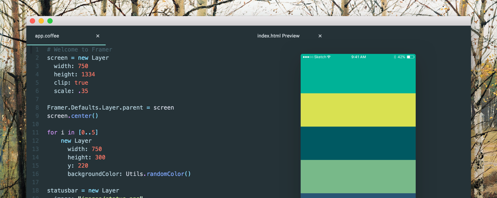

Framer.js и Framer Studio — разные вещи. Framer.js — это бесплатная JavaScript-библиотека, которой можно пользоваться в любом редакторе кода; Framer Studio — платное приложение. Я расскажу, как с помощью редактора Atom запустить Framer.js на Windows и OS X.



---

Чтобы начать работу, достаточно скачать шаблон проекта с официального сайта Фреймера в разделе **[builds.framerjs.com](http://builds.framerjs.com)** и открыть в любом редакторе кода.


<small>[builds.framerjs.com](http://builds.framerjs.com)</small>

Файлы внутри шаблона организованы как на обычном сайте:

- **index.html** запускается для просмотра прототипа. Он уже правильно настроен для любого проекта. Его придется менять, если только вы добавляете в проект другие JavaScript-библиотеки ([D3.js](http://d3js.org), [Hammer.js](http://hammerjs.github.io)).
- **app.js** — сюда дизайнер пишет свой код на языке JavaScript (чтобы писать на CoffeeScript нужно создать файл **app.coffee** самостоятельно).
- **/framer** — папка с библиотекой Framer.js.
- **/images** — папка с нарезкой макета, шрифтами и прочими материалами.

Открываем **app.js** в редакторе, а **index.html** в браузере.


В принципе все готово к работе и на этом можно остановиться, но рабочее окружение можно еще улучшить:

- Создать файл **app.coffee** и писать весь код на CoffeeScript, т.к. [документация библиотеки](http://framerjs.com/docs/#layer.layer) составлена под него. 
- Установить плагины, которые при каждом сохранении документа будут конвертировать наш CoffeeScript и автоматически обновлять превью в браузере.


## Установка Атома
Атом — редактор кода от разработчиков Гитхаба. Выбор пал на него из-за удобного интерфейса установки плагинов, в котором ненужно лезть в командную строку или config-файлы. Скачать здесь:

<center><h3>[atom.io](https://atom.io)</h2></center><br>

После установки мы видим экран приветствия:


Нужно выбрать Install a Package › Open Installer и попадаем сюда:


Вбиваем в поиске **coffee compile** и **html preview**. Устанавливаем их:


Теперь нужно правильно настроить плагины:
- в настройках Coffee-Compile включить **Compile on save without preview**. Наш код будет конвертироваться в JavaScript по каждому нажатию <kbd>Ctrl</kbd><kbd>S</kbd> на Винде (и <kbd>Cmd</kbd><kbd>S</kbd> на Маке). 
- в настройках HTML-Preview включить **Trigger On Save**. Как только изменится файл с JavaScript, превью моментально отобразит все изменения.


## Создание нового проекта

Каждый проект создается на основе шаблона. Откроем его в Атоме. Чтобы открылся весь проект, а не один его файл, не кликайте по папке два раза — просто выделите ее и нажмите кнопку Open (либо <kbd>Enter</kbd>).


Если все сделано правильно, то слева в редакторе мы увидим список файлов нашего проекта. Первым делом нужно удалить все содержимое **app.js** и переименовать его в **app.coffee**:


Теперь заходим в **index.html**, нажимаем правой кнопкой мыши внутри файла и выбираем **Preview HTML**.


Теперь можно закрыть вкладку **index.html** (но не **index.html Preview**). Попробуем написать пробный код, чтобы проверить работу окружения:

- я сохранил в папку **images** изображение с домашним экраном Айфона.
- вписал код и нажал «Сохранить».
- автоматически создался файл **app.js** (сработал Coffee-Compile) и в превью появилось изображение (сработал HTML-Preview).


На картинке видно, что браузер отображает экран в размере 100%. Это неудобно, т. к. высота экрана Айфона в пикселях больше, чем высота Макбука (1400px vs. 900px). Плюс ко всему превью растягивает прототип в пропорциях окна редактора. 

Чтобы это починить, можно вписать следующий код, который необходимо удалять перед публикацией прототипа в интернет:

```CoffeeScript
# Осторожно! Не копируйте этот код, а напишите сами —
# при копировании сбиваются отступы и пробелы.

screen = new Layer
  width: 750
  height: 1334
  clip: true
  backgroundColor: "black"

screen.scale = Screen.height / screen.height
screen.center()
Framer.Defaults.Layer.parent = screen
```


## Публикация прототипа

Одно из важнейших преимуществ Framer Studio по сравнению с редактором кода — возможность расшарить свой прототип в один клик: всем пользователям приложения предоставляется бесплатный хостинг на **share.framerjs.com**.

Если у вас есть собственный хостинг, то можете загружать свой прототип через ftp. В одной из следующих статей разберем, как загружать прототипы на бесплатный хостинг [GitHub Pages](https://pages.github.com/) через приложение [GitHub Desktop](https://desktop.github.com/).


