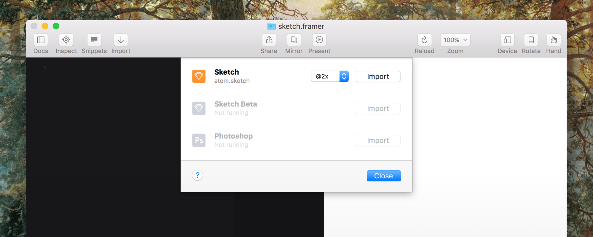
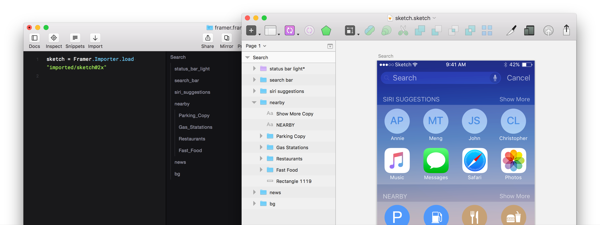
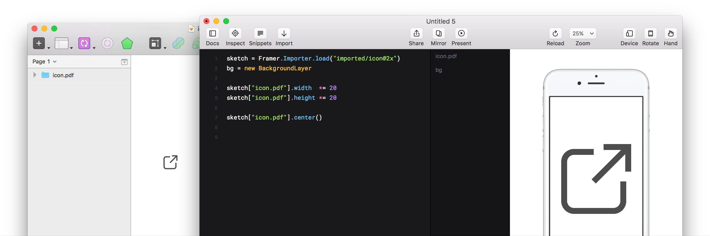
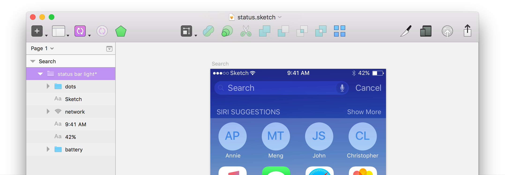
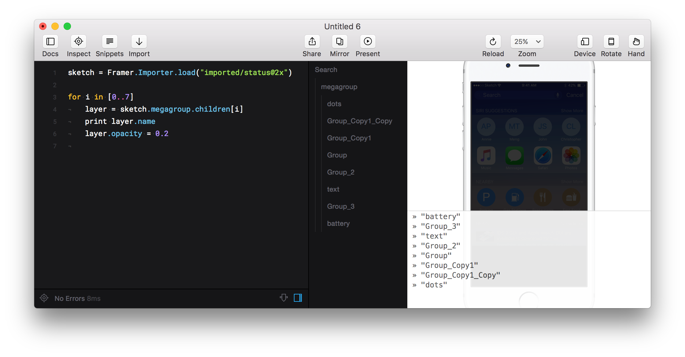

Код — инструмент без ограничений. Но есть задачи, решать которые через программирование не самый легкий и, главное, не самый эффективный путь. Грамотная организация импорта из Скетча во Фреймер позволит этим инструментам дополнять друг друга: как можно раньше проверять гипотезы в интерактиве, вносить изменения в макет и моментально применять их к прототипу.



---

Фишки импорта во Фреймере:

- Все слои переносятся из Скетча в один клик. Фреймер сам расставляет их на холсте, поэтому «версткой» прототипа заниматься не придется.
- Работает с макетами, нарисованными в @1x. Позволяет масштабировать их в 1.5x, 2x, 3x и 4x.
- Умеет импортировать вектор.
- Понимает артборды, маски, некоторые свойства обычных слоев.


## Как устроен импорт слоев
Слоем во Фреймере станет каждая группа или символ из Скетча. Если внутри группы есть другая группа, то во Фреймере она станет вложенным слоем. Обычные слои внутри папки (как фигуры, так и текст) сольются в одну картинку и станут фоновым изображением своей папки. Слои, которые не попали ни в одну папку, станут фоновым изображением артборда.


<small>Слои Show More Copy, NEARBY и Rectangle 1119 станут фоном слоя nearby</small>

После импорта к слоям можно обращаться по их именам с приставкой `sketch.`:

```CoffeeScript
# Правильно (sketch.слой.свойство):
sketch.nearby.opacity = 0.25
sketch.Parking_Copy.draggable = true

# Неправильно (вложенность не нужна):
sketch.nearby.Parking_Copy.opacity = 0.25
```

<div class="iframe">
    
    <iframe
        src="https://player.vimeo.com/video/158629547?autoplay=1&loop=1&title=0&byline=0&portrait=0" frameborder="0" webkitallowfullscreen mozallowfullscreen allowfullscreen>
    </iframe>
</div>


Скрытые группы тоже импортируются, но с параметром `visible: false`. По умолчанию, они невидимы и во Фреймере, но в любой момент их можно включить через строку кода:

```CoffeeScript
sketch.layerName.visible = true
```

#### Как правильно называть группы и символы
Здесь действую правила именования переменных в JavaScript: 

- Все пробелы в имени будут заменены на «_». 
- Цифры можно использовать, но не первым символом в названии. Если хотя бы у одного слоя имя будет начинаться с числа, то импорт не состоится.
- Нельзя использовать знаки пунктуации, кроме символов «$» и «_». Фреймер позволит импортировать слой с любым именем, но ошибки появятся при попытке вызовать неправильное имя. Либо можно забить и обращаться к слоям таким образом:

```CoffeeScript
sketch["flat.design"].opacity = 0.25
```


--- 

## Пять практических советов

#### 1. Используйте маску в Скетче, чтобы создать скрол во Фреймере
Любая маска импортируется как обычный слой с параметром `clip: true` («не показывать содержимое за пределами слоя»). Одной строкой кода можно преобразовать маску из обычного объекта `Layer` в `ScrollComponent`:

```CoffeeScript
scroll = ScrollComponent.wrap(sketch.feed)
```

<div class="iframe">
    
    <iframe
        src="https://player.vimeo.com/video/158648874?autoplay=1&loop=1&title=0&byline=0&portrait=0" 
        frameborder="0" webkitallowfullscreen mozallowfullscreen allowfullscreen>
    </iframe>
</div>

---

#### 2. Импортируйте векторную через PDF
Про
layer*



```CoffeeScript
sketch["layer.pdf"]
```
---


#### 3. Растрируйте ненужные группы и символы
Просто 



---

#### 4. Работайте со слоями как с массивами
Одно из преимущество кода — автоматизация. Вы можете применять однотипные события и анимации ко всем слоям внутри конкретной папки. Либо обращаться к ним по порядковому номеру.

```CoffeeScript
array = ["A", "B", "C"]

for i in [0..2]
    print array[i]

# "A"
# "B"
# "C"
```


<small>↑ Мы присвоили перменной layer все 8 дочерних слоев megagroup. Затем двумя строками кода выводим все их имена в консоль и меняем разом прозрачность</small>

```CoffeeScript
for index in [0..7]
    print sketch.megagroup.children[index]

# <Layer id: 3  name:battery          (-640,  90)   28 x 28>
# <Layer id: 4  name:Group_3          (-468,  50)  154 x 70>
# <Layer id: 5  name:text             (-468,  50)  154 x 70>
# <Layer id: 6  name:Group_2          (-688,   0)  158 x 112>
# <Layer id: 7  name:Group            (-512, 100)  154 x 70>
# <Layer id: 8  name:Group_Copy1      (-512, 100)  154 x 70>
# <Layer id: 9  name:Group_Copy1_Copy (-512, 100)  154 x 70>
# <Layer id:10  name:dots             (-640,  90)   28 x 28>
```

Также CoffeeScript поддерживет особую форму циклов специально для массивов (в этом случае цикл сам посчитает, сколько раз ему нужно повториться):

```CoffeeScript
for layerX in sketch.megagroup.children
    print layerX

# <Layer id: 3  name:battery          (-640,  90)   28 x 28>
# <Layer id: 4  name:Group_3          (-468,  50)  154 x 70>
# <Layer id: 5  name:text             (-468,  50)  154 x 70>
# <Layer id: 6  name:Group_2          (-688,   0)  158 x 112>
# <Layer id: 7  name:Group            (-512, 100)  154 x 70>
# <Layer id: 8  name:Group_Copy1      (-512, 100)  154 x 70>
# <Layer id: 9  name:Group_Copy1_Copy (-512, 100)  154 x 70>
# <Layer id:10  name:dots             (-640,  90)   28 x 28>
```

Если нам все же необходимо знать номер индекса, мы можем написать так:

```CoffeeScript
for layerX, index in sketch.megagroup.children
    print index, layerX.name

# 0, "battery"
# 1, "Group_3"
# 2, "text"
# 3, "Group_2"
# 4, "Group"
# 5, "Group_Copy1"
# 6, "Group_Copy1_Copy"
# 7, "dots"
```
---

#### 5. Работайте с относительными значениями
Еще одно из преимуществ программирования — вычисления. Чтобы сделать ваш прототип более устойчивым к изменениям размеров и координат разных слоев, прописывайте все величины не числами, а процентами размеров экрана. Например, вместо этого:

```CoffeeScript
sketch.layer.x     = 100
sketch.layer.width = 650
```

…пишите лучше так:

```CoffeeScript
sketch.header.maxX  = Screen.width
sketch.header.width = Screen.width - 100
```

Теперь, если изменится размер экрана или вы измените ширину слоя, то при обновлении импорта все значения пересчитаютяс автоматически.

Чтобы выравить объект по центру экрана можно писать так:

```CoffeeScript
sketch.header.midX = Screen.width  / 2
sketch.header.midY = Screen.height / 2
```
