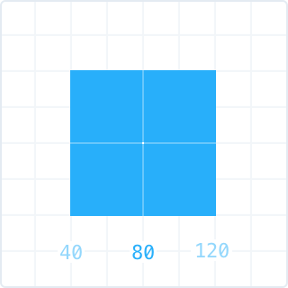

Код — инструмент без ограничений. Но есть задачи, решать которые через программирование не самый легкий и, главное, не самый эффективный путь. Грамотная организация импорта из Скетча во Фреймер позволит этим инструментам дополнять друг друга: как можно раньше проверять гипотезы в интерактиве, вносить изменения в макет и моментально применять их к прототипу.


---

Фишки импорта во Фреймере:

1. Все слои переносятся из Скетча в один клик. Фреймер сам расставляет их на холсте, поэтому «версткой» прототипа заниматься не придется.
2. Работает с макетами, нарисованными в @1x. Позволяет масштабировать их в 1.5x, 2x, 3x и 4x.
3. Умеет импортировать вектор.
4. Понимает артборды, маски, некоторые свойства обычных слоев.


## Как устроен импорт слоев
Слоем во Фреймере становится каждая группа или символ из Скетча. Вложенность папок сохраняется (артборды в это случае тоже считаются группой). 

Все несгруппированные слои (как фигуры, так и текст) будут слиты в растровую картинку и станут фоновым изображением той папки, внутри которой они лежат.


<small>Слои Show More Copy, NEARBY и Rectangle 1119 станут фоном слоя nearby</small>

В коде к слоям можно обращаться по их именам с приставкой `sketch.`:

```CoffeeScript
# Правильно (sketch.слой.свойство):
sketch.nearby.opacity = 0.25
sketch.Parking_Copy.draggable = true

# Неправильно (вложенность не нужна):
sketch.nearby.Parking_Copy.opacity = 0.25
```

<div class="iframe">
    
    <iframe
        src="https://player.vimeo.com/video/158629547?autoplay=1&loop=1&title=0&byline=0&portrait=0" frameborder="0" webkitallowfullscreen mozallowfullscreen allowfullscreen>
    </iframe>
</div>


Скрытые группы тоже импортируются, но с параметром `visible: false`. По умолчанию, они невидимы и во Фреймере, но в любой момент их можно включить через строку кода:

```CoffeeScript
sketch.layerName.visible = true
```

#### Как правильно называть группы и символы
Здесь действую правила именования переменных в JavaScript: 

- Все пробелы в имени будут заменены на «_». 
- Цифры можно использовать, но не первым символом в названии. Если хотя бы у одного слоя имя будет начинаться с числа, то импорт не состоится.
- Нельзя в качестве названия использовать зарезервированные в программировании слова, вроде `var`, `if`, `else`, `true`, `false`, `for`, `in`, `switch`, `function`, `interface`, `new`, `delete`, `this`, `default`…
- Нельзя использовать знаки пунктуации, кроме символов «`$`» и «`_`». Фреймер позволит импортировать слой с любым именем, но ошибки появятся при попытке использовать его в коде. Можно забить на это правило и обращаться к слоям таким образом:

```CoffeeScript
sketch["flat.design"].opacity = 0.25
```


--- 

## Используйте маску в Скетче, чтобы создать скрол во Фреймере
Любая маска импортируется как обычный слой, но одной строкой кода ее можно преобразовать в `ScrollComponent`:

```CoffeeScript
scroll = ScrollComponent.wrap(sketch.feed)
```

<div class="iframe">
    
    <iframe
        src="https://player.vimeo.com/video/158648874?autoplay=1&loop=1&title=0&byline=0&portrait=0" 
        frameborder="0" webkitallowfullscreen mozallowfullscreen allowfullscreen>
    </iframe>
</div>

---

## Импортируйте векторную графику через PDF
Просто в имени слоя укажите расширение `.pdf`. Использование точки в именах переменных запрещено, поэтому придется обращаться к слою так:

```CoffeeScript
sketch["icon.pdf"].opacity = 0.25
```


<small>Теперь никакой размытой графики при увеличении в 20 раз</small>

---


## Не импортируйте лишние слои
Сгруппируйте их в папку, название которой заканчивается символом «`*`», и Фреймер сольет все ее содерживое в одно растровое изображение.


<small>Во Фреймер экспортируется только один слой — `status_bar_light`</small>

---

## Работайте со слоями как с массивами
Большое преимущество Фреймера перед другими инструментами — программирование. Все слои импортируются из Скетча в виде массивов, поэтому мы можем редактировать разом все слои одного артборда или накладывать однотипные анимаций внутри отдельных групп. 

Например, мы хотим сдвинуть все слои внутри артборда на 20 пикселей. Мы можем сделать это через цикл:

```CoffeeScript
for i in [0..9]
    sketch.Artboard.children[i].x += 20
```

Либо мы можем уменьшить непрозрачность всех слоев внутри папки `megagroup` до 20%:


<small>Мы присвоили перменной `layer` все 8 слоев внутри `megagroup`. Теперь одной стройкой кода мы можем вывести их имена либо поменять прозрачность</small>

В записи с диапазоном `[0..9]` неудобно то, что нужно заранее знать, сколько слоев внутри группы. Этого можно избежать: специально для массивов в CoffeeScript есть отдельный вид циклов `for—in`:

```CoffeeScript
# Подвинуть все слои внутри megagroup на 20px вправо
for layer in sketch.megagroup.children
    layer.x + = 20
```

Иногда параметр цикла все-таки нужен:

```CoffeeScript
# 1-й слой подвинется на 20px, 
# 2-й — на 40px, 3-й — на 60px…
for layer, i in sketch.megagroup.children
    layer.x += 20 * i
```

Цикл `for—in` работает только с «детьми» указанной группы, а «дети ее детей» уже недоступны. Например, если вывести все вложенные слои артборда `Search` то увидим только один:

```CoffeeScript
for layer, i in sketch.Search.children
    print layer.name
# → "megagroup"
```

Доступ к абсолютно всем импортированным слоям можно получить через объект `sketch`. Для объектов в CoffeeSctipt тоже есть отдельный вид циклов — `for–of`:

```CoffeeScript
for k, layer of sketch
    layer.visible = false

```


<small>Внутри объекта sketch все слои хранятся без учета иерархии и в обратном порядке</small>

---

## Работайте с относительными значениями
Еще одно из преимуществ программирования — вычисления. Указывайте все размеры и координаты не абсолютными значениями, а относительно размеров экрана. 

Вы сможете сделать ваш прототип более устойчивым к постоянным изменениям размеров и координат любого элемента на экране. Вы даже сможете сделать прототип адаптивным, и он будет корректно отображаться на больших и маленьких экранах. В этом поможет глобальный объект `Screen`, который хранит всю информацию о размерах окна:

```CoffeeScript
print Screen.width  # → 750 для iPhone 6
print Screen.height # → 1334

sketch.card.height = Screen.height * 0.4 + 20
sketch.card.width  = Screen.width - 100

sketch.background.size  = Screen.size
```

Чтобы не повторять каждый раз приставку `sketch.layer.` в каждой строке, можно использовать атрибут `props`:

```CoffeeScript
sketch.card.props = 
    height:  Screen.height * 0.4 + 20
    width:   Screen.width - 100
    opacity: 0.5
```

Указывать координаты объектов через `x` и `y` — не единственная возможность. Иногда удобно выравнивать объект относительно его центра или правого края.

```CoffeeScript
sketch.card.x    = 40
sketch.card.midX = 80
sketch.card.maxX = 120
```

Результат любой из этих трех строк выдаст один и тот же результат:

<center></center>

Например, так мы можем выравнивать объект по центру экрана:

```CoffeeScript
sketch.card.midX = Screen.width  / 2
sketch.card.midY = Screen.height / 2
```
