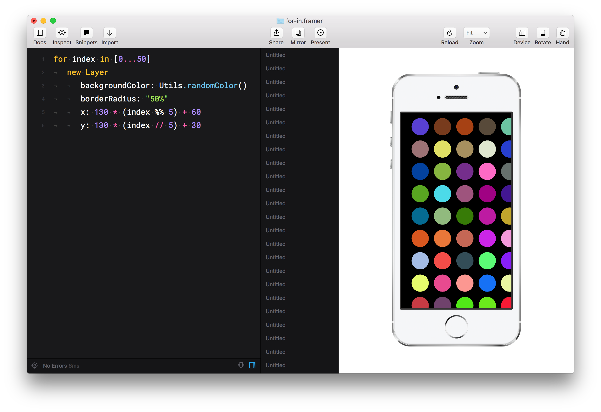

---

В Фотошопе есть клевая панелька 

## Программирование — одна фишек Фреймера
GUI-инструменты направлены 


```coffeescript
for i in [0..40]
  item = new Layer 
    y: 210 * i + 10
```



Еще одно применение циклов — это работа с повторяющимися структурами данных. 

```coffeescript
data = JSON.parse Utils.domLoadDataSync "data/file.json"
users = data["users"]

```

```coffeescript
for index in [0...5]
  user = users[index] 
  nameData = user.name
  roleData = user.role

```

```coffeescript
for index in [0...5]
  user = users[index] 
  nameData = user.name
  roleData = user.role
  
  layerA = new Layer
    y: index * 259 + 40
    width: 750, height: 256
    html:
      "<h3>#{nameData}</h3>" +
      "<p>#{roleData}</p>"
    style:
      font: "300 1.8em 'Helvetica Neue'"
      padding: "35px 40px"
      backgroundColor: "#33333D"
```


## Разновидности циклов во Фреймер

В большинстве языков существует три вида циклов: `for`, `while… ` и `do… while`, и CoffeeScript (`for`, `while`, `loop`) в том числе, но Фреймер почему-то поддерживает только `for`. 

Зато в 10 формах:


### 1. Классика
Так:

```coffeescript
for i in [0..20]
  print "Hellow world!"
```


### 2. Сокращенная версия
Иногда итератор может быт не нужен, а CoffeeScript борется за лаконичность:

```coffeescript
for [0..20]
```

### 3. Расширенная версия
С возможностью менять шаг

```coffeescript
for i in [0..20] by 2
```

### 4. Цикл внутри массива
С возможностью менять шаг

```coffeescript
names = ["Anton", "Nikolay", "Yuri"]

for name in names
  print name
```

### 5. Цикл внутри массива с параметром
С возможностью менять шаг

```coffeescript
names = ["Anton", "Nikolay", "Yuri"]

for name, i in names
  print "#{i}. #{name}
```

### 6. Цикл внутри объекта
С возможностью менять шаг

```coffeescript
object = 
  "Name": "Anton Kartashov"
  "Age": 26
  "City": "Moscow"

for key, value of object
  print "#{key} — #{value}""
```


### 7. Задом наперед
Для одного действия

```coffeescript
print "Hello" for in [0..10]
```


### 8. Цикл с условием

```coffeescript
eat food for food in foods when food isnt 'chocolate'
```


### 9. forEach: Цикл по массиву №2
Для массивов есть свой метод:

```coffeescript
["one", "two", "three"].forEach text ->
  print text
```


### 10. Цикл с повторением данных
Иногда хочется взять 3-5 картинов и сделать из них быстро длинный список — чтобы выглядело правдопободно, но без заморочек. Тогда можно гонять эти картинки по кругу. Чтобы понять как это делается нужно узнать операцию «остаток от деления»:

`33 / 5 = 6`, остаток: `3` 

В любом языке программирования его можно получить одной операцией (`modulo`):

```coffeescript
number = 33 % 5
# Теперь number == 3
```

Например, у нас есть всего 4 картинки, мы хотим получить цикл на 50 итераций. По странному совпадению остаток от деления `i / 4` как раз всегда будет повторяться таким образом: 

```
0 % 4 == 0
1 % 4 == 1
2 % 4 == 2
3 % 4 == 3

4 % 4 == 0
5 % 4 == 1
6 % 4 == 2
7 % 4 == 3
…
```

Применяем:

```coffeescript
pictures = [
  "mountain.png"
  "river.png"
  "sky.png"
  "medvedev.png"
]


for i in [0..50]
  ii = i % 4
  image = pictures[ii]

  # Либо
  image = pictures[i % 4]

  # Либо (если не хотим считать, сколько в массиве элементов)
  image = pictures[i % pictures.length]    

```